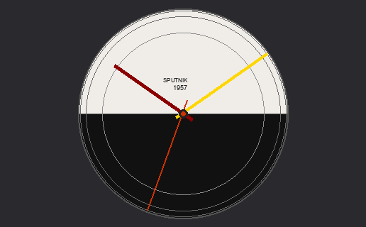

# Sputnik Clock — [Übersicht](https://github.com/felixhageloh/uebersicht) widget



A desktop clock inspired by Sputnik-era styling: 24-hour dial, gold minute and burgundy hour hands, second hand on the outer ring. Refreshes at ~120 Hz.

This repo follows the [widget gallery layout](https://github.com/felixhageloh/uebersicht-widgets#widget-format): `widget.json`, `sputnik.widget.zip`, `screenshot.png` (516×320 for Retina), plus an unpacked copy in `sputnik.widget/` for browsing the source and sending pull requests.

## Requirements

- macOS  
- [Übersicht](https://github.com/felixhageloh/uebersicht)

## Installation

**Option A — archive (gallery format):** unzip `sputnik.widget.zip` to get the `sputnik.widget` folder, then add it to your widgets directory:
 
```bash
open ~/Library/Application\ Support/Übersicht/widgets/
```

Drag the `sputnik.widget` folder there (Übersicht will pick up the `.jsx` inside).

**Option B — single file:** copy `sputnik.jsx` (from the repo root or from `sputnik.widget/`) into:

```bash
cp sputnik.jsx ~/Library/Application\ Support/Übersicht/widgets/
```

Refresh widgets from the Übersicht menu or restart the app.

## On-screen position

At the top of `sputnik.jsx`, `className` sets `bottom`, `right`, and dimensions — adjust for your display.

## Widget gallery

To list this widget in the [gallery](https://github.com/felixhageloh/uebersicht-widgets), [open an issue](https://github.com/felixhageloh/uebersicht-widgets/issues) and include your repository URL.

## Updating gallery artifacts

After editing `sputnik.jsx`:

```bash
cp sputnik.jsx sputnik.widget/
zip -r sputnik.widget.zip sputnik.widget
# update screenshot.png if needed (258×160 or 516×320 per gallery guidelines)
```
